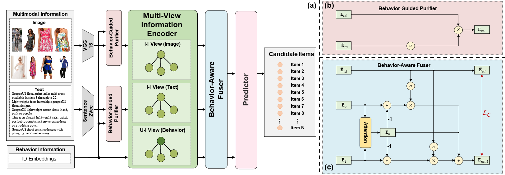
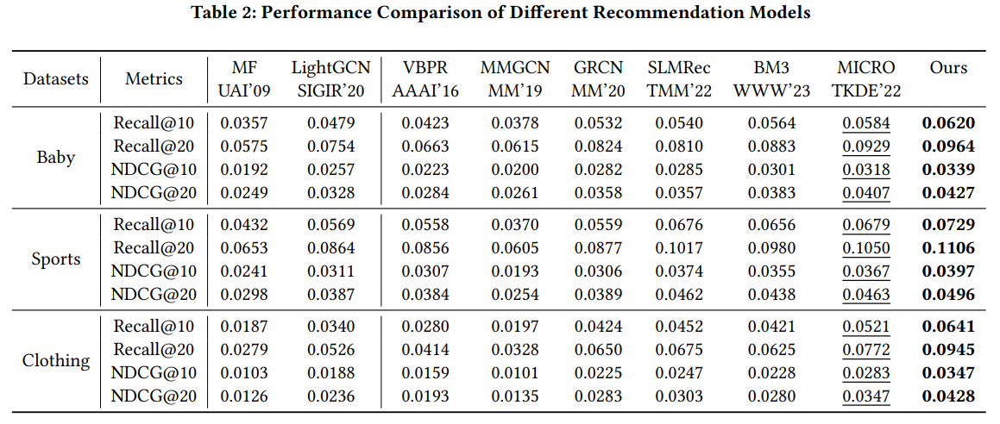

# MGCN: Multi-View Graph Convolutional Network for Multimedia Recommendation

<!-- PROJECT LOGO -->
<br />
<div align="center">
  <a href="https://github.com/demonph10/MGCN">
    
  </a>
</div>

## Introduction

This is the Pytorch implementation for our MM 2023 paper:

>MM 2023. Penghang Yu, Zhiyi Tan, Guanming Lu, Bing-Kun Bao(2023). Multi-View Graph Convolutional Network for Multimedia Recommendation


## Enviroment Requirement
- python 3.8
- Pytorch 1.12

## Dataset

We provide three processed datasets: Baby, Sports and Clothing.

Download from Google Drive: [Baby/Sports/Clothing](https://drive.google.com/file/d/1tpP-IQtUubSlVvYpkA61bffPKkhvT62T/view?usp=drive_link)

## Training
  ```
  cd ./src
  python main.py
  ```
## Performance Comparison


## Citing MGCN
If you find MGCN useful in your research, please consider citing our [paper](https://arxiv.org/abs/2308.03588).
```
@article{yu2023multi,
  title={Multi-View Graph Convolutional Network for Multimedia Recommendation},
  author={Yu, Penghang and Tan, Zhiyi and Lu, Guanming and Bao, Bing-Kun},
  booktitle={Proceedings of the 31st ACM International Conference on Multimedia},
  pages = {6576–6585},
  year={2023}
}
```
The code is released for academic research use only. For commercial use, please contact [Penghang Yu](y463213402@gmail.com).


## Acknowledgement
The structure of this code is  based on [MMRec](https://github.com/enoche/MMRec). Thank for their work.
